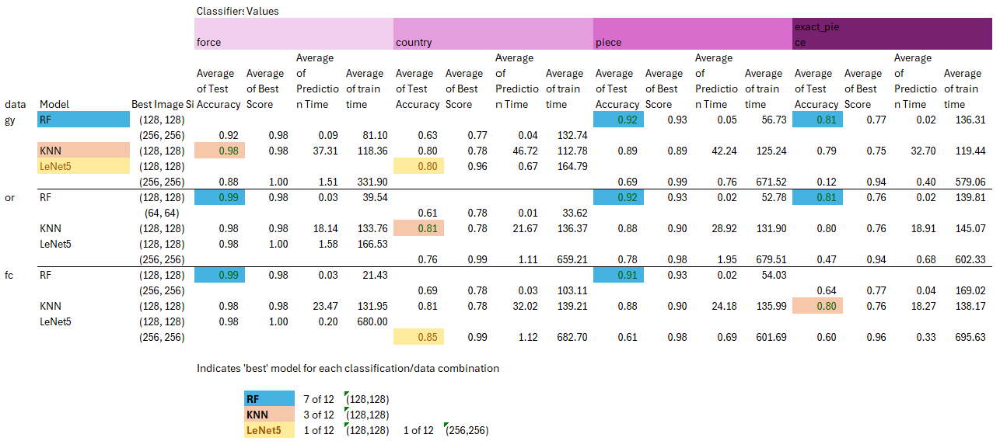

# Capstone Project.

This relates to the capstone project for the Professional Certification in Machine Learning and Artificial Intelligence from Imperial College University. The capstone project is the final assessment of skills and knowledge to complete the course.

## NON-TECHNICAL EXPLANATION OF YOUR PROJECT

Hypothesis:  More (depth) data means better performance.

iPhone and other smartphone pictures are beginning to collect 'depth map' data which records the distance an object is from the lens.  
We have 1530 photos of board game pieces including this data.

We will compare image classification performance (accuracy/time to train) for 3 models on 4 classifications with this depth map data:

K-Nearest Neighbours, which derives similarities/distances between pictures.  
Random forest, which is a combination of a series of yes/no questions around image information.  
A LeNet5 neural network, which is an image specialised model that slowly improves predictions and works in a similar way to the human eye.

## DATA

The data used has been generated by taking 1530 jpg photos, in portrait (compatibility) mode, on an iPhone 15 pro.  This data is high resolution and has been pre-processed and cropped to be a reduced size to run in the models.

There is sufficient data to test 12 scenarios, using different versions of the data.  These scenarios are generate by combinations of image channels (3) and classification groups (4).

The data can be varied by 'channels' of data from the photos.  Greyscale (black and white) photos use one channel, Original/ordinary photos use 3 colour channels (red,green,blue) and we have an additional channel which is the depth map to generate a four-channel option (RGB+depth)

When we model, we will also look at different types of image classification, that is identifying the content of the photo.  There are 4 options in this.  We are using photos from Axis & Allies 1941 pieces, which is a WW2 strategy game.  

There are 5 playable countries in the game (Russia, Germany, UK, Japan, USA) and identifying which country a piece belongs to is the 'country' classification.  The piece sculpts are slightly different for each country and all the pieces are a different colour plastic.

The next classification is 'force', this is a slightly artificial categorisation which divides the pieces by land, sea or air 'force'.

Another classification is 'piece', there are 9 pieces infantry, tank, fighter, bomber, sub, sea transport, destroyer, battleship, carrier.

The final classification is 'exact_piece' which is a combination of the country and the piece.  There are 5x9 = 45 classes in this, e.g. UK inf, UK tank, UK fighter etc.

## MODEL 

Having reviewed the 3 models, ultimately I would use the Random Forest (128x128) model.  This model performed best for accuracy in 7/12 scenarios compared to its peers and was also faster to train (30 mins compared to 2hrs + for the others).

In addition, through optimising the choice of models, I could increase the RF128 performance to 10/12 scenarios.  This was by re-using the exact_piece model with 81% performance for models which could be derived from that accuracy (e.g. country) and also IGNORING the additional data available from the depth map data.  The remaining 2 lower performance items were greyscale/force (where KNN had 98% accuracy, Random Forest 92%) and country/four-channel (where KNN had 85% accuracy, Random Forest 81%)

In assessing the models we used accuracy as the main measure, but also collected timings.  It is also worth noteing that RF and KNN are easier models to explain in detail compared to LeNet5.  This is another advantage of selecting this model.

## HYPERPARAMETER OPTIMISATION
Description of which hyperparameters you have and how you chose to optimise them. 

I performed a gridsearch of hyperparameters for all 3 models.

For example, for Random Forest, the hyperparameter space was:
	Number of Estimators	10, 50 or 100
	Criteria		Gini
	Max_depth		None, 10, or 20
	Min_samples_split	2
	min_samples_leaf	1

In addition, the model was run with 3 different image sizes (64x64, 128x128, 256x256).  I investigated larger sizes, but disgarded as they increase training time and early indications gave 128x128 the best performance so the performance would be worse.

With the models run separately with greyscale, original and four-channel data and the 4 classifications to generate 12 scenarios.

That is, I ran a model using all those potential options in the grid-search.  Each of these options generated 5 different sets of results which were averaged, as I used k(5)-fold cross validation.  This was run on 80% of the data (called the training-validation data).  The best model for accuracy from the cross validation was then tested on the final 20% of information (test data).

## RESULTS  (A summary of results and what you can learn from your model) 
I found that the random forest model was best for overall accuracy and training time across the 12 different scenarios (of 3 types of different data and 4 classification models).  By choosing different combinations of models Random Forest (RF) could perform best in 10/12 scenarios.

To get the best performance, it was actually best to IGNORE the new data in four-channel, and use the original 3-channel data.  Also for the country classifier, it was better to take the results from a more complex model (exact_piece) and map back to country.

KNN performed better in the 2/12 scenarios, but generally performed slightly worse than RF and took 4 to 5 times longer to train.

LeNet5 was initially expected to be the 'best' model from the training.  I used 3 image sizes[(64x64),(128x128),(256x256)], batch sizes [32,64] and epochs [10,20] and these were generating some results in 'training' in the high 90%'s.  However, when the models were used on the test model, they significantly underperformed (dropping to 47% to 85%).  This suggests that the models could be overfit as training performance is not maintained in testing.  I have not expanded the hyper-parameter area to investigate this poor performance.

### Hypothesis: More (depth) data improves performance
	Failed hypothesis - actually ignoring the additional channel and relying on original data provided better performance

	Failed hypothesis - similarly, the models were based on 3 image sizes, (64x64), (128x128) and (256x256) but the (128x128) with less data 	performed best

## CODE and LOCALISATION (running locally)
There are 6 python blocks of code, ordered 000 to 005 (although 002 is empty).

These are expected to run in that order.

There are localisation notes above every block of code, which usually consist of changing source and target folder or file locations.

There is manual intervention as well.  There is a labelling file which was generated manually.  Additionally the SummaryResults.xlsx file has been linked to the 36 'best' model results file using power query in excel, which avoids having to open all the files to get data.  (3 file types x 4 classifiers = 12 scenarios; 12 scenarios x 3 models = 36).  Sheets marked _HC are hardcoded versions of this analysis that support the conclusions in this paper.

The folder structure and where code interacts is here:

## (CONTACT DETAILS)
Please contact stephen@recast.finance

