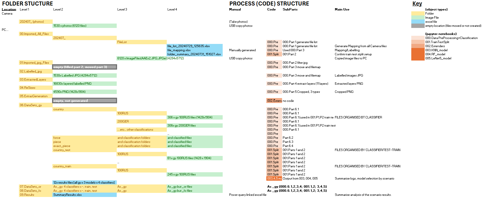

# Datasheet

This is a datasheet for the Data images with depth map data.

## Motivation

- For what purpose was the dataset created?
	The dataset was created for the purposes of this project as images with depth maps were unavailable.  It is for an image classification 	comparison.

- Who created the dataset (e.g., which team, research group) and on behalf of which entity (e.g., company, institution, organization)? 
	Acct4Git generated this dataset

- Who funded the creation of the dataset?
	Self-funded

 
## Composition

- What do the instances that comprise the dataset represent (e.g., documents, photos, people, countries)? 
	The primary data is image related, photos of board game pieces from Axis and Allies 1941.
	The photos are taken to include depth map information.

- How many instances of each type are there?
	There are 34 instances of each 'exact-piece' category.  And 45 classes in this classification type.  Totalling 1530 instances.
	There are 9 pieces of each of the 5 countries which means that piece, exact_piece and country classifications are balanced.
	The force classification groups 2 Air, 2 Land, 5 Sea pieces and is therefore not balanced.
	There are 0 images for no-piece.

- Is there any missing data?
	There is no missing data, however manual review of the 'portrait' depth map photos indicates some maps as faint.
	Additionally, no-piece classifiers were excluded

- Does the dataset contain data that might be considered confidential (e.g., data that is protected by legal privilege or by    doctor–patient confidentiality, data that includes the content of individuals’ non-public communications)?
	No

## Collection process

- How was the data acquired? 
	The photos were taken by using an iPhone 15 pro in portrait mode, this mode when enabled takes photos which include depth map  	information as an additional image.  The iPhone must have settings set to generate JPG files in compatibility mode.  If HEIC images are 	taken in portrait mode, they do not export depth map data.

	The photos were taken on the same day with the phone in similar positions.  A stand was used to try to and provide similar tilts and 	positioning for the photos.  It also enabled the 'portrait' mode to signify depth was available more regularly as the phone needed to be 	some distance from the subject for this to enable.

	For each image there were 8 photos taken from the phone in a stand and positioned level, 8 with a left tilt, 8 with a right tilt.    

	The 8 were on different rotations from East looking to SE, South, SW,W,NW,N,NE.  Then a further 5 in front profile, moved back 	and 	forth; and 5 move with a back profile moved back and forth.
	This is a total of (8+8+8+5+5) = 34 photos per object.

	The photos were taken of board game pieces.  They consisted of 9 different 'piece' types for 5 different 'countries'.  This makes 45 	combinations.  Notably, the sculpts for the units of different countries are similar but slightly different.  The countries pieces are 	all coloured with the same plastic, but different lighting can make these colours look different.

	The photos were copied, via USB, from the phone to a folder on a PC for processing.

- If the data is a sample of a larger subset, what was the sampling strategy? 
	Not applicable, there was no larger dataset

- Over what time frame was the data collected?
	The data was collected on 1 day from late morning to late afternoon.  The (8x3)x45 photos were taken first, when this was completed a 	further (2x5)x45 were taken in late afternoon.

## Pre-processing/cleaning/labelling

- Was any pre-processing/cleaning/labelling of the data done (e.g., discretization or bucketing, tokenization, part-of-speech tagging, SIFT feature extraction, removal of instances, processing of missing values)? If so, please provide a description. If not, you may skip the remaining questions in this section. 
	The pre-processing of the phone is detailed with the code.  
	It included:
		- Removal of surplus photos copied across
		- Selection from the 6120 files exported, the relevant JPG files
		- Labelling and renaming of the 1530 files
		- Extracting 11 layers from each of the 1530 files and generating 16830 PNG files
		- Cropping 3/11 extracts, taking the central 1/9th to generate 4590 PNG files (1428x1904). 1530 for 1-, 3-, 4-channel files.
		- Copying files into 'Classification' folders with classes as subfolders, where relevant files were copied.
		- Splitting train/test data (80%, 20%) for each of the classifications
	At the end of the pre-processing there were training and test folders with images in sub-classes available for models.
	
	For KNN and Random Forest models there was additional data processing to resize, feature extract and flatten data to extract data.  
		3 sizes were used (64x64)(128x128) and (256x256).
	For LeNet5, these same sizes were used which was not necessary but done to provide comparison.
		
	
- Was the “raw” data saved in addition to the pre-processed/cleaned/labelled data (e.g., to support unanticipated future uses)? 
	Yes, apart from the imported jpg, which were renamed and moved, all data is available.
 
## Uses

- What other tasks could the dataset be used for? 
	Other image tasking, testing other models.
	Potentially used for image segmentation, Yolo or other models.

- Is there anything about the composition of the dataset or the way it was collected and pre-processed/cleaned/labelled that might impact future uses? For example, is there anything that a dataset consumer might need to know to avoid uses that could result in unfair treatment of individuals or groups (e.g., stereotyping, quality of service issues) or other risks or harms (e.g., legal risks, financial harms)? If so, please provide a description. Is there anything a dataset consumer could do to mitigate these risks or harms?
	The data was prepared with a wooden table rather than a board (from a boardgame) underneath.  This could prevent interactions with 	boards and placement.

	There was no 'blank' category, so we always had a piece as a category.  So it might not handle missing pieces if images are cropped 	without a piece.

	We did not enhance the images, although there was space in the code logic.  E.g. take partial images, reflections, blurring etc.

	There are no known consumer impacts or risks as the objects are board game pieces.

	Extras generation where the images were reworked to generate more images, with noise, was considered but not actioned

	We did not check the quality of the depth maps generated, merely that the model (portrait) took a photo in the correct format (jpg)

- Are there tasks for which the dataset should not be used? If so, please provide a description.
	No

## Distribution

- How has the dataset already been distributed? 
	Only in GitHub

- Is it subject to any copyright or other intellectual property (IP) license, and/or under applicable terms of use (ToU)?  
	No

## Maintenance

- Who maintains the dataset?
	The dataset is maintained by Acct4Git

## Structure

The data is transformed as it moves through the modelling and pre-processing steps.  The following shares where the relevant image and excel files.

