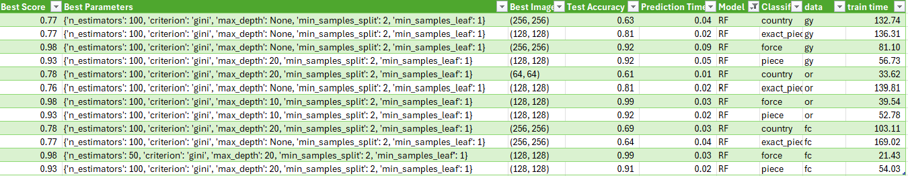
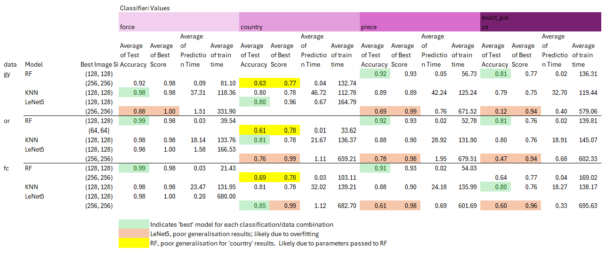
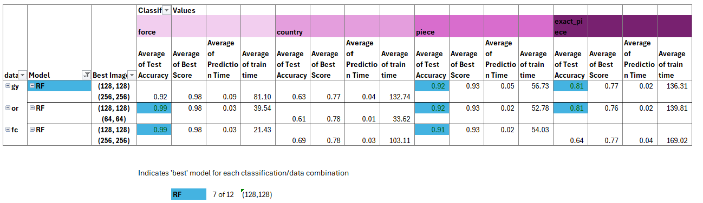
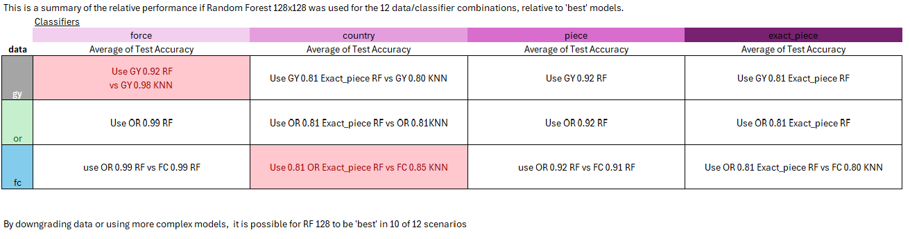
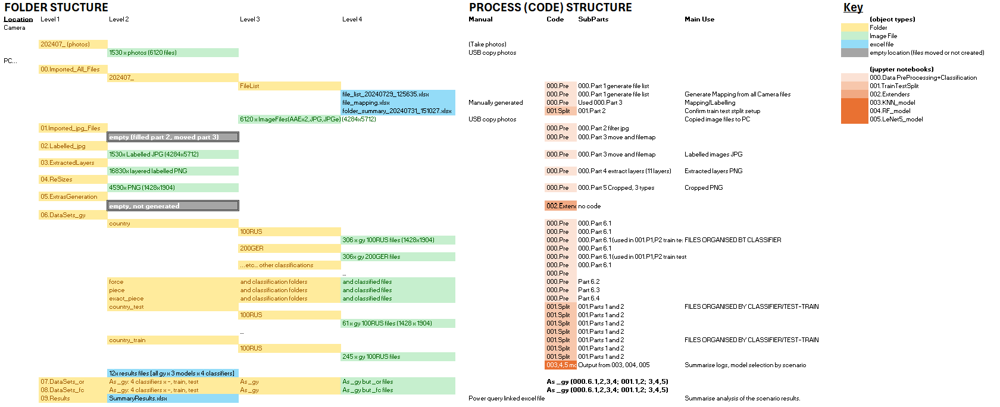

# Model Card

This is the model card for the Random Forest (128x128) model.
This model uses the code in 004.RF_model.ipynb

## Model Description

**Input:** 
The code takes in test and training images, pre-classified into relevant class folders, 
These are PNG (1428x1904) images.

These images are pre-processed, flattened, to be used in the model and set to different image sizes, in this case 128x128

**Output:** (Describe the output(s) of your model)

The outputs from each individual scenario for RF are in excel files in the relevant data set folder.
e.g.
	06.DataSets_gy > gy_country_RF_results_ … date time  … .xlsx

Each of these files contains:
	Best Parameters			The chosen grid parameters generating the best result
	Timing_results			The training time and training result(accuracy) for every combination of image size x grid
	Confusion_Matrices		Training confusion matrices for the best of each image size
	Test_Classification_Report	On test data - a summary classification performance report
	Test_Confusion_Matrix		On test data - the confusion matrix (having used the best grid, image parameters from training)
	Image_Predictions		On test data - an image by image actual vs predicted list
	Summary				A summary of the training and test results
	Logs				Performance logs including the training time for the single grid model

The best models from each of these individual files has been summarised into the:
	09.Results > SummaryResults.xlsx file.

This file in addition to summarisation of results contains the additional information related to performance comparisons between models.

**Model Architecture:** (Describe the model architecture you’ve used)

Using RF as the main model for the 12 scenarios, generated different hyper-parameters per scenario.

However, if one model were to be used for all:

Image size 128x128 (11 of 12)

The hyper-parameters for the RF 128 are typically:
	n_estimators		100		11 of 12 (50: 1 of 12)
	criterion		gini		no choice
	max_depth		20		5 of 12 (None: 5 of 12, 10: 2 of 12)
	min_samples_split	2		no choice
	min_samples_leaf	1		no choice

The above hyper-parameters were chosen by first establishing the model (RF) and image size (128) compared to the other models best performers.  A majority rule was then used to select from the best performing RF models.  With None and 20 being equal for max_depth, I looked at how many of each matched 128 when best (None: 2 of 5, 20: 3 of 5) and chose the most aligned to 128.

Running all these models would NOT be required.  For example, I would use the _OR data rather than run against the _FC data.  I would use exact_piece for country (see below in performance)

The hyperparameter data is here: 

Ideally, each scenario would use its recommended hyperparameters.

## Performance : Give a summary graph or metrics of how the model performs. Remember to include how you are measuring the performance and what data you analysed it on. 

Overall, the performance of the model was based on accuracy, with considerations for training time.  Accuracy was chosen as a misclassification of any type would be equally bad as all classes were 'equal'.  Time was also used, as it was a limiting constraint to further use of the modelling, ideally we want realtime predictions and straightforward timely training.

The results for all models, including RF are here:

As can be seen, in 7 of 12 scenarios the RF 128 model outperformed the KNN and LeNet5.

Focussing on RF models only:

We can see that where the models performed on test accuracy was using 128x128 image size.  In addition, performance on 'country' was relatively poor, the average of 'best' score which is the results from the training data was in the 70s but performance on 'test' data was in the 60s. This weaker performance can be mitigated though as the results from the 'exact_piece' can be mapped directly to 'country' to provide a 81% accuracy.

Allowing for the above use of or_ exact piece.  This means that the whole _OR line results are equal or greater than _FC.  FC is OR+depth map, so if necessary we could remove that extra layer to get the same improved results as OR.

This hybrid approach of available overrides allows us to perform significantly well in 10 of 12 scenarios.

We also considered training time, with more complex models limited by processing time/laptop performance.  In this RF came out well with the shortest model training time.

The final performance consideration is explability, the RF model is as explainable as KNN and better than LeNet5.  This would help if the model needed to be explained to others.

## Limitations : Outline the limitations of your model.
## BIASES and KNOWN ISSUES

### Processing
We only introduced parallel processor running into the modelling, not the data pre-processing.  Some of the data processing takes 2-4 hours and could benefit from performance improvements.

We specifically used an iPhone, other depth maps from other sources could be clearer.

### Images/Data
Some images had different lighting and angles, and it could be difficult to determine the colour due to flash or have consistent colours.  e.g. some UK (tan) items are light brown, some dark brown (shadowed).

Some images (North, South views) provided very little profile and could be unlike other angles.

Some depth maps look very faint, we did not verify that there were clear ones per photo

The depth map was a lower resolution than the images and we chose to expand the size of the depth map to cover and align to the other channels.

We chose to use the lower resolutions (64x64, 128x128, 256x256) for the LeNet5, when it could potentially directly run from the cropped images (1428x1904) directly.  I used the lower sizes in part to improve timing performance.

We did not 'enhance' the selection of images to increase volumes by cropping, rotating, diffusing/adding noise etc.

The images have a semi-static background, but there are light effects that vary over time.

### Models
We only adapted the data for KNN and RF in one way.  It is also possible to generate profiles on the data based on the volumes of different colours in the photos.  The performance of the RF on 'country' (which is colour based) and 'exact_piece', might be improved if this was done.

We did not research other parameters for the LeNet5 grid-search.  We found that is was not performing well, but did not investigate whether this could be resolved by amending the hyperparameters.

The models selected the 'best' results 'automatically' from the grid-search based on accuracy, this could be nuanced to consider other factors such as training time or what to pick if there are equal results. [Outside this RF model: This can be seen in the KNN model choosing between Uniform and Distance weights.  Uniform is run first and generates equal results with Distance.  But only for the first result, n_neighbors = 1, after Distance appears to be a better measure].

We have not applied the overlay model to generate final results.

### Results
We did not look into the confusion matrices to identify which images were problematic and look for themes.  We do not know if any of the data is specifically difficult to predict (although image by image data has been collected).

We have not identified exactly what is problematic with country (or colour) classification and its impact on exact_piece.

## Trade-offs : Outline any trade-offs of your model, such as any circumstances where the model exhibits performance issues. 

There is a potential trade-off for 'country' as noted.  We have not investigated the drop in performance and whether this is under or over fitting, and how to address (changed grid-search, adapted inputs into the model (e.g. colour histograms).  We have applied another model over the top.

## CODE and LOCALISATION (running locally)
There are 6 python blocks of code, ordered 000 to 005 (although 002 is empty).

These are expected to run in that order.

There are localisation notes above every block of code, which usually consist of changing source and target folder or file locations.

There is manual intervention as well.  There is a labelling file which was generated manually.  Additionally the SummaryResults.xlsx file has been linked to the 36 'best' model results file using power query in excel, which avoids having to open all the files to get data.  (3 file types x 4 classifiers = 12 scenarios; 12 scenarios x 3 models = 36).  Sheets marked _HC are hardcoded versions of this analysis that support the conclusions in this paper.

The folder structure and where code interacts is here:

